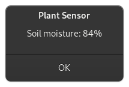
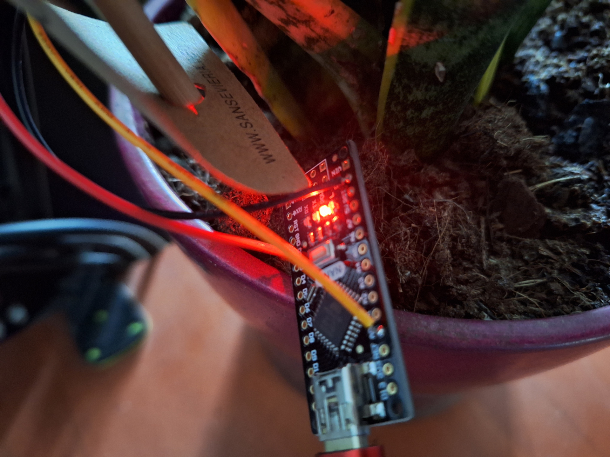
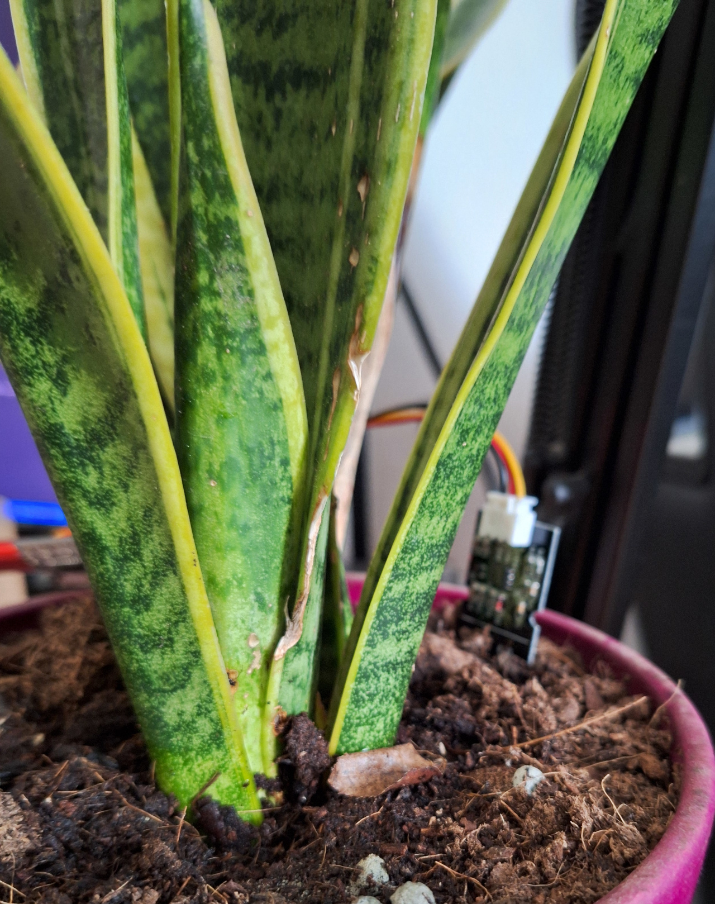

# Plant Moisture Sense

This project reads soil moisture sensors data via a serial connection to an Arduino.



|Arduino Nano|Moisture Sensor|
|:---:|:---:|
|||


## Hardware:
- Arduino Nano
- Capacitive Soil Moisture Sensor (v1.2)    
    > I've used [KeeYees 3 Pieces Soil Moisture Sensor Capacitive](https://www.amazon.de/-/en/gp/product/B07R174TM1/)
- USB Cable

It is powered by the USB connection, as it doesn't need much current. 

You can find more information on Capacitive Soil Moisture Sensors and how they work, here: https://lastminuteengineers.com/capacitive-soil-moisture-sensor-arduino/

## Build Instructions:

1) Solder the wires coming from the Soil Moisture Sensor to the Arduino Nano.

    | Wire | Arduino Pin | Description |
    | :--- | :--- | :--- |
    | Red | D2 | The Sensors power is switched on only when needed for measuring.
    | Black | GND | Ground
    | Yellow | A0 | The ADC get the sensors analog signal. It is in the range of ```1.5 - 3.0``` Volt

2) Put the Moisture Sensor in the soil.
3) Use the USB cable to connect the Arduino to your computer.
4) (Optional) It is a good idea to waterproof the PCB's edges of your Soil Moisture Sensor. A simple way that i used was to coat the edges using nail polish.

## Installation:
1) Clone the repository to your local machine:
    ```
    git clone https://github.com/MajortomVR/PlantMoistureSense.git
    ```
2) Open ```Arduino/Plant_Moisture_Sensor/Plant_Moisture_Sensor.ino``` using the Arduino IDE.
3) Upload the code on the Arduino.
4) Note the port address that your Arduino is available on. You may have to adjust it in Plant_Sensor.py to your specific one.


## Usage:
1) To run the desktop application, use the following command:
    ```
    python3 Plant_Sensor.py
    ```

You may have to adjust the sensor MIN_SENSOR_VALUE and MAX_SENSOR_VALUE in Plant_Sensor.py to fit your sensor and plant. Below are values that i found out through testing with my sensor.


| Description | Sensor Value |
| :--- | :--- |
| Sensor in a glass of water | ~290 |
| Sensor hanging in the air | ~640 |


Over time i adjusted the values to fit my plants well-being.

| Description | Value |
| :--- | :--- |
| Soil's moisture level is at 0% | >= 500 |
| Soil's moisture level is at 100% | <= 350 |